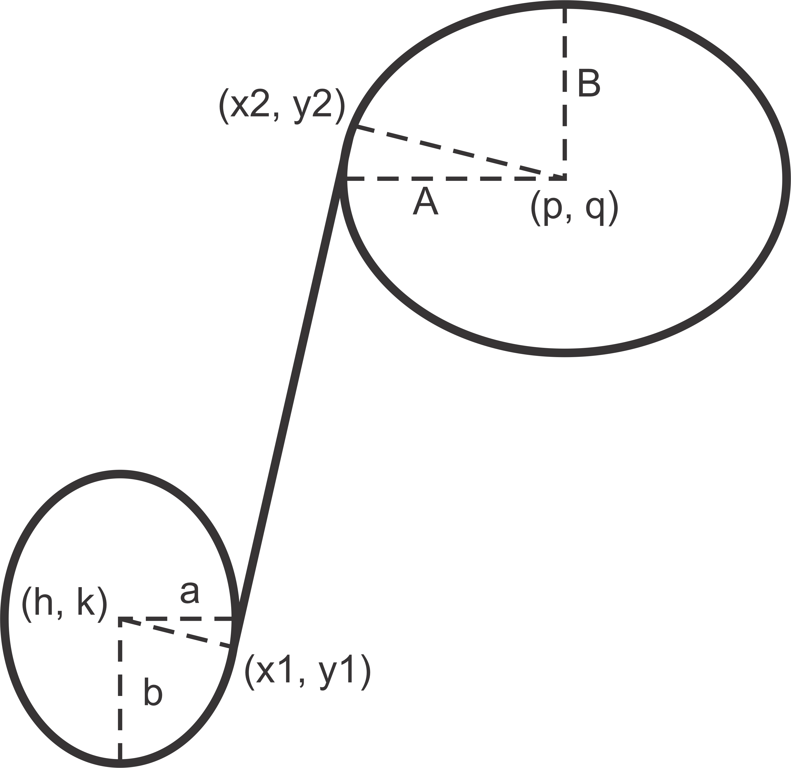

Quick Start Guide
#################

This **Quick Start Guide** gives a fast and simple introduction into PoC. All
topics can be found in the :ref:`Using PoC <USING>` section with much more
details and examples.

.. contents:: Contents of this Page
   :local:

.. _QUICK:Requirements:

Requirements and Dependencies
*****************************

The CaDH is a GUI for coordinating different electromagnetic codes.
It also comes with some scripts to ease most of the common tasks. CaDH uses
Python 3 as a platform independent scripting environment.
All Python scripts are wrapped in Bash or PowerShell scripts,
to hide some platform specifics of Darwin, Linux or Windows.
See :ref:`USING:Require` for further details.

.. rubric:: CaDH requires:

* The **Python 3** programming language and runtime.

.. rubric:: CaDH optionally requires:

* **Git** command line tools or
* **Git User Interface**, if you want to check out the latest 'master' or 'release' branch.

All dependencies are contained in requirements.txt

.. _QUICK:Download:

Download
********

The CaDH-Library can be downloaded as a `zip-file <https://github.com/Dark-Elektron/CavityDesignHub/archive/refs/heads/master.zip>`_
(latest 'master' branch), cloned with ``git clone`` or embedded with
``git submodule add`` from GitHub. GitHub offers HTTPS and SSH as transfer
protocols. See the :ref:`Download <USING:Download>` page for further
details. The installation directory is referred to as ``CaDHRoot``.

+----------+----------------------------------------------------------------------------+
| Protocol | Git Clone Command                                                          |
+==========+============================================================================+
| HTTPS    | git clone --recursive https://github.com/Dark-Elektron/CavityDesignHub.git |
+----------+----------------------------------------------------------------------------+
| SSH      | git clone git@github.com:Dark-Elektron/CavityDesignHub.git                 |
+----------+----------------------------------------------------------------------------+

.. _QUICK:Configuration:

Configuring CaDH  on a Local System
*********************************

CaDH currently makes use of other software for analysis. These software are not
outrightly open source but could be obtained from the website of the author.

For wakefield analysis, the ABCI code is required.

.. rubric:: 1. Download ABCI code from `here <https://abci.kek.jp/abci.htm>`.
ABCI version 12.5 is recommended.

.. rubric:: 2. Copy files

Copy the files from the downloaded zip file to ``<root>\CavityDesignHub\exe\ABCI_exe``
This can be done directly on Windows by copying the files to the specified folder
or from the command line using

**On Windows**

First extract the files from ``ABCI_MP_12_5.zip``

.. code-block:: PowerShell

   cd CaDHRoot
   unzip ABCI_MP_12_5.zip

Copy all files in extracted folder to ``<root>\CavityDesignHub\exe\ABCI_exe``

.. code-block:: PowerShell

    robocopy ABCI_MP_12_5 <root>\CavityDesignHub\exe\ABCI_exe /COPYALL /E

**On Linux**

.. code-block:: PowerShell

   cd <folder containing zip file>
   unzip ABCI_MP_12_5.zip

Copy all files in extracted folder to ``<root>\CavityDesignHub\exe\ABCI_exe``

.. code-block:: PowerShell
    cp -a /ABCI_MP_12_5/. /<root>\CavityDesignHub\exe\ABCI_exe/

.. _QUICK:RunSimulation:

Run a Simulation
****************

Once you're able to setup, you can launch the GUI by navigating to the
folder containing the ``main.py`` file and running the following command from
the Windows command line

.. code-block:: python

   python3 main.py

If you have an IDE, open and :guilabel:`run` ``main.py`` directly in the IDE. This
open the GUI as shown in the following figure

.. _gui home page:

The GUI shows a grid of buttons.

**Eigenmode Analysis**

First,we are going to run an eigenmode analysis.
* **Click on :guilabel:`EIGENMODE ANALYSIS`. This takes you to another frame
which contains different fields and buttons.

There are four major categories on the left pane.
These are :guilabel:`Cell Geometric Parameters`, :guilabel:`Cell Parameters`,
:guilabel:`Analysis Settings` and :guilabel:`Uncertainty Quantification`.

Let's say we wanted to run an eigenmode analysis on the mid cell TESLA cavity ref{}
which has geometric dimensions [A, B, a, b, Ri, L, Req] = []
for one eigenmode for single module single mid cell without beam pipes.

For this, we set the boundary conditions of the left and right ends of the cavity
to ``Magnetic Wall En=0`` in order to obtain the TM010:math:`-\pi` mode.

* **Click on :guilabel:`Cell Geometric Parameters` to expand the input fields
for the geometric parameters if not already expanded.

To enter the geometry for simulation, we create a ``.json`` file which
contains the dimensions. The structure of the ``.json`` file is shown below

.. code-block:: json

    {
        "cavity_name":{
            "IC": [
                124.44, <- A
                132.25, <- B
                60.44, <- a
                42.23, <- b
                143.972, <- Ri
                187, <- L
                342.4, <- Req
                94.50406852541953 <- alpha
            ],
            "OC": [
                125.16,
                115.08,
                34.42,
                24,
                160.76,
                191.6255,
                342.4,
                112.08716030100433
            ],
            "OC_R": [
                125.16,
                115.08,
                34.42,
                24,
                160.76,
                191.6255,
                342.4,
                112.08716030100433
            ],
            "BP": "both", <- beampipe
            "FREQ": 400.79 <- fundamental mode frequency
        }
    }

Multiple entries are also possible. An example of a `.json` file that contains
two cavities is

.. code-block:: json

    {
        "cavity_1":{
            "IC": [
                ...
                ],
            "OC": [
                ...
                ],
            "OC_R": [
                ...
                ],
            "BP": "both",
            "FREQ": 400.79
        },
        "cavity_2":{
            "IC": [
                ...
                ],
            "OC": [
                ...
                ],
            "OC_R": [
                ...
                ],
            "BP": "both",
            "FREQ": 400.79
        }
    }

This file can be saved to ``Cavities`` folder in the project directory. To load
the file, click on :guilabel:`...`.

Click on :guilabel:`Cell Parameters` to expand the widget if not already expanded.
You should see the fields ``No. of Cells`` and ``No. of Modules``. Set both of them
to ``1``.

Click on :guilabel:`Analysis Settings` to show the analysis settings widgets.
You should see the following in your GUI

Leave the ``Freq. Shift`` as ``0``, ``No. of Modes`` should be left as `1` since
we are only interested in one mode. Leave the polarity as `Monopole` and if the
``Left BC`` and ``Right BC`` should be set to ``Magnetic Wall En=0``. The number
of ``Processors`` should be set to ``1``.

The analysis is now ready to be run. Click on the play button at the bottom right
of the panel to run.

The results are written to ``<root>/<project_name>/SimulationData/SLANS/<filename>``
If no name was given, the results are saved to
``<root>/<project_name>/SimulationData/SLANS/Cavity0. The quantities that
we are interested in could be found in ``qois.json``. This file is writen by
Python. The SLANS written files can be viewed using the corresponding executatble
file in ``<root>/CavityDesignHub/exe/SLANS_exe. The table below shows the
files and corresponding executable files to open them.

+--------------------------+--------------------+----------------------------------------------+
| Executable               | File               | Remark                                       |
+==========================+====================+==============================================+
| :guilabel:`genmesh2.exe` | ``<filename>.geo`` | Used to view the geometry and mesh           |
+--------------------------+--------------------+----------------------------------------------+
| :guilabel:`slansc.exe`   | ``<filename>.geo`` |                                              |
+--------------------------+--------------------+----------------------------------------------+
| :guilabel:`slansd.exe`   | ``<filename>.geo`` |                                              |
+--------------------------+--------------------+----------------------------------------------+
| :guilabel:`slansm.exe`   | ``<filename>.geo`` |                                              |
+--------------------------+--------------------+----------------------------------------------+
| :guilabel:`slanss.exe`   | ``<filename>.geo`` |                                              |
+--------------------------+--------------------+----------------------------------------------+
| :guilabel:`slansre.exe`  | ``<filename>.res`` | For most cases, only this executable is used |
+--------------------------+--------------------+----------------------------------------------+

The geometry could also be entered manually by filling in the values in the field
with the corresponding geometric parameter values.

.. _QUICK:Updating:

Updating
********

The PoC-Library can be updated by using ``git fetch`` and ``git merge``.

.. code-block:: PowerShell

   cd CaDHRoot
   # update the local repository
   git fetch --prune
   # review the commit tree and messages, using the 'treea' alias
   git treea
   # if all changes are OK, do a fast-forward merge
   git merge

.. seealso::
   :doc:`Running one or more testbenches </UsingPoC/Simulation>`
      The installation can be checked by running one or more of PoC's testbenches.
   :doc:`Running one or more netlist generation flows </UsingPoC/Synthesis>`
      The installation can also be checked by running one or more of PoC's
      synthesis flows.
