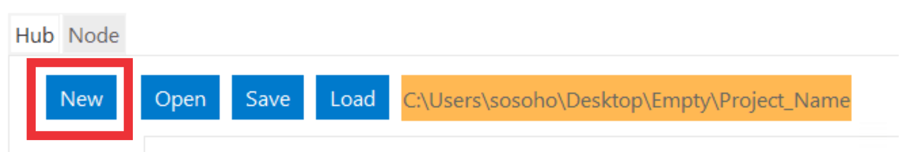

Quick Start Guide
#################

This **Quick Start Guide** gives a fast and simple introduction into PoC. All
topics can be found in the :ref:`Using PoC <USING>` section with much more
details and examples.

.. contents:: Contents of this Page
   :local:

.. _QUICK:Requirements:

Requirements and Dependencies
*****************************

The CaDH is a GUI for coordinating different electromagnetic codes.
It also comes with some scripts to ease most of the common tasks. CaDH uses
Python 3 as a platform independent scripting environment.
All Python scripts are wrapped in Bash or PowerShell scripts,
to hide some platform specifics of Darwin, Linux or Windows.
See :ref:`USING:Require` for further details.

.. rubric:: CaDH requires:

* The **Python 3** programming language and runtime.

.. rubric:: CaDH optionally requires:

* **Git** command line tools or
* **Git User Interface**, if you want to check out the latest 'master' or 'release' branch.

All dependencies are contained in requirements.txt

.. _QUICK:Download:

Download
********

The CaDH-Library can be downloaded as a `zip-file <https://github.com/Dark-Elektron/CavityDesignHub/archive/refs/heads/master.zip>`_
(latest 'master' branch), cloned with ``git clone`` or embedded with
``git submodule add`` from GitHub. GitHub offers HTTPS and SSH as transfer
protocols. See the :ref:`Download <USING:Download>` page for further
details. The installation directory is referred to as ``CaDHRoot``.

+----------+----------------------------------------------------------------------------+
| Protocol | Git Clone Command                                                          |
+==========+============================================================================+
| HTTPS    | git clone --recursive https://github.com/Dark-Elektron/CavityDesignHub.git |
+----------+----------------------------------------------------------------------------+
| SSH      | git clone git@github.com:Dark-Elektron/CavityDesignHub.git                 |
+----------+----------------------------------------------------------------------------+

.. _QUICK:Configuration:

Configuring CaDH  on a Local System
*********************************

CaDH currently makes use of other software for analysis. These software are not
outrightly open source but could be obtained from the website of the author.

For wakefield analysis, the ABCI code is required.

.. rubric:: 1. Download ABCI code from `here <https://abci.kek.jp/abci.htm>`.
ABCI version 12.5 is recommended.

.. rubric:: 2. Copy files

Copy the files from the downloaded zip file to ``<root>\CavityDesignHub\exe\ABCI_exe``
This can be done directly on Windows by copying the files to the specified folder
or from the command line using

**On Windows**

First extract the files from ``ABCI_MP_12_5.zip``

.. code-block:: PowerShell

   cd CaDHRoot
   unzip ABCI_MP_12_5.zip

Copy all files in extracted folder to ``<root>\CavityDesignHub\exe\ABCI_exe``

.. code-block:: PowerShell

    robocopy ABCI_MP_12_5 <root>\CavityDesignHub\exe\ABCI_exe /COPYALL /E

**On Linux**

.. code-block:: PowerShell

   cd <folder containing zip file>
   unzip ABCI_MP_12_5.zip

Copy all files in extracted folder to ``<root>\CavityDesignHub\exe\ABCI_exe``

.. code-block:: PowerShell
    cp -a /ABCI_MP_12_5/. /<root>\CavityDesignHub\exe\ABCI_exe/

.. _QUICK:RunSimulation:

Run a Simulation
****************

Once setup is complete, the GUI can be launched by navigating to the folder containing the ``main.py`` file.
Run the following command from the Windows command line

.. code-block:: python

   python3 main.py

In a Python IDE, open and :guilabel:`run` ``main.py`` directly in the IDE. This opens the GUI as shown in the following figure

.. _gui home page:

Create New Project
^^^^^^^^^^^^^^^^

To create a new project,

* Click on :guilabel:`New` on the menubar.

|
* Enter the name of the project and click :guilabel:`Enter` on your keyboard.

|
* Specify the folder to save the project to.

|
* Now we are ready for our first analysis.

|

Eigenmode Analysis
^^^^^^^^^^^^^^^^^^

First,we are going to run an eigenmode analysis.
* | Click on :guilabel:`EIGENMODE ANALYSIS`. This takes you to another frame which contains different fields and buttons.

There are four major categories on the left pane.
These are :guilabel:`Cell Geometric Parameters`, :guilabel:`Cell Parameters`,
:guilabel:`Analysis Settings` and :guilabel:`Uncertainty Quantification`.

Let's say we wanted to run an eigenmode analysis on the mid cell TESLA cavity ref{}
which has geometric dimensions [A, B, a, b, Ri, L, Req] = []
for one eigenmode for single module single mid cell without beam pipes.

For this, we set the boundary conditions of the left and right ends of the cavity
to ``Magnetic Wall En=0`` in order to obtain the TM010:math:`-\pi` mode.

* | Click on :guilabel:`Cell Geometric Parameters` to expand the input fields
  | for the geometric parameters if not already expanded.

To enter the geometry for simulation, we create a ``.json`` file which contains the dimensions.
The structure of the ``.json`` file is shown below. The inner cell ``IC`` parameters are
``[A, B, a, b, Ri, L, Req]`` = `[42, 42, 12, 19, 35, 57.7, 103.3, 0]`. the left
outer cell ``OC`` parameters are
``[A, B, a, b, Ri, L, Req]`` = `[42, 42, 12, 19, 35, 57.7, 103.3, 0]`,
and the right outer cell parameters ``OC_R`` are
``[A, B, a, b, Ri, L, Req, alpha]`` = `[42, 42, 12, 19, 35, 57.7, 103.3, 0]`. The outer cell and inner cell dimensions
are the same since we are considering just the mid cell of the TESLA cavity. No beam pipes are required so ``BP`` is
set to ``none``. The frequency ``FREQ`` is set to the desired frequency.

.. code-block:: json

    {
        "cavity_name":{
            "IC": [
                42,
                42,
                12,
                19,
                35,
                57.7,
                103.3,
                0
            ],
            "OC": [
                42,
                42,
                12,
                19,
                35,
                57.7,
                103.3,
                0
            ],
            "OC_R": [
                42,
                42,
                12,
                19,
                35,
                57.7,
                103.3,
                0
            ],
            "BP": "none",
            "FREQ": 1300
        }
    }

.. note::

   Multiple entries are also possible. An example of a `.json` file that contains
   two cavities is

   .. code-block:: json

       {
           "cavity_1":{
               "IC": [...],
               "OC": [...],
               "OC_R": [...],
               "BP": "both",
               "FREQ": 400.79
           },
           "cavity_2":{
               "IC": [...],
               "OC": [...],
               "OC_R": [...],
               "BP": "both",
               "FREQ": 1300
           }
       }

* | Create a file in the project sub directory ``Cavities`` and copy the above json formatted text to the file. Change
  | ``cavity_name`` to ``TESLA``. Save the file with a `.json` extension.

* | Click on :guilabel:`Cell Geometric Parameters` to expand the widget if not already expanded.

* | Click on :guilabel:`...` and navigate to the file to load the file.

* | Once loaded, click on :guilabel:`Select Shape` dropdown. You should see the ``<cavity_name>`` in the dropdown.
  | In our case, ``<cavity_name>`` is ``TESLA``. Select it.

* | Click on :guilabel:`Cell Parameters` to expand the widget if not already expanded. Set the fields
  | ``No. of Cells`` and ``No. of Modules`` to ``1``.

* | Click on :guilabel:`Analysis Settings` to show the analysis settings widgets.

* | Leave ``Freq. Shift`` as ``0``, ``No. of Modes`` should be left as `1` since
  | we are only interested in one mode. Leave the polarity as `Monopole` and if the
  | ``Left BC`` and ``Right BC`` should be set to ``Magnetic Wall En=0``. The number
  | of ``Processors`` should be set to ``1``.

* | Click on the play button at the bottom right of the panel to run.

* | Navigate to ``SimulationData/SLANS/TESLA`` to see results.

The results are written to ``<root>/<project_name>/SimulationData/SLANS/<cavity_name>``
If no name was given, the results are saved to ``<root>/<project_name>/SimulationData/SLANS/Cavity0. The quantities that
we are interested in could be found in ``qois.json``. This file is writen by
Python. The SLANS written files can be viewed using the corresponding executable
file in ``<root>/CavityDesignHub/exe/SLANS_exe. The table below shows the
files and corresponding executable files to open them.

+--------------------------+--------------------+----------------------------------------------+
| Executable               | File               | Remark                                       |
+==========================+====================+==============================================+
| :guilabel:`genmesh2.exe` | ``<filename>.geo`` | Used to view the geometry and mesh           |
+--------------------------+--------------------+----------------------------------------------+
| :guilabel:`slansc.exe`   | ``<filename>.geo`` |                                              |
+--------------------------+--------------------+----------------------------------------------+
| :guilabel:`slansd.exe`   | ``<filename>.geo`` |                                              |
+--------------------------+--------------------+----------------------------------------------+
| :guilabel:`slansm.exe`   | ``<filename>.geo`` |                                              |
+--------------------------+--------------------+----------------------------------------------+
| :guilabel:`slanss.exe`   | ``<filename>.geo`` |                                              |
+--------------------------+--------------------+----------------------------------------------+
| :guilabel:`slansre.exe`  | ``<filename>.res`` | For most cases, only this executable is used |
+--------------------------+--------------------+----------------------------------------------+

The geometry could also be entered manually by filling in the values in the field
with the corresponding geometric parameter values.

Tune
^^^^

In the design of accelerator cavities, we usually want the cavity to operate at a particular
frequency. We have 6 variables to play around with and one variable is reserved for tuning
to the desired frequency. In most cases, the equator radius ``Req`` is the preferred
variable for tuning for mid cell cavities. For the end cells, L is the tune variable.
There are several other variations to this. For example, in a single or 2 cell cavity,
L or Req could be selected as the tune variable. For cavities with flat-tops, like
the Jlab cavities \ref{}, ``l``, the length of the flat top section is the tune
variable.

In the following example, we will tune Req of the mid cell of a TESLA   cavity to
operate at a fundamental mode frequency of 1300~MHz. The description of the fields are
given in \ref{}.

* | On the homepage of the application, click on :guilabel:`TUNE` or the side button :guilabel:`T`. This will navigate
  | to the `Tune` frame.

* | Select ``Mid Cell`` as the ``Cell Type``, ``Variable`` as ``Req``. Leave ``Method``,
  | ``Tuner`` as ``PyTune``, ``Left BC`` and ``Right BC`` as ``Magnetic Wall En=0``,
  | ``N Cells`` as ``1`` and ``Frequency`` to ``1300``.

* | Enter the geometric parameters to the corresponding fields

* | Click on the play button to run.

.. note::

   The SLANS software creates a lot of pop ups during the running of any simulation so the system would become
   unusable for the period of the tuning or eigenmode analysis. It is most noticable when a large number of
   cavities are tuned or analysed in one sweep.

Wakefield Analysis
^^^^^^^^^^^^^^^^^^^^

The process to run wakefield analysis using ABCI is similar to that for eigenmode
analysis. The geometry is loaded exactly the same.

* | Click on :guilabel:`...` to open the file dialog box and select the `.json` file
  | containing the geometric parameters

* | Click on :guilabel:`Cell Parameters` to set the number of cells, modules, length of the
  | left beam pipe, polarity and number of processor. Set ``Polarity`` to ``monopole`` to
  | calculate for the longitudinal wakefield analysis, ``Dipole`` for transverse wakefield analysis
  | and ``Both`` for both longitudinal and transverse wakefield analysis. Select ``Both``.

The results are written to ``SimulationData/ABCI/<filename>``. If no name was given, the results are saved to
``SimulationData/ABCI/Cavity0. The quantities that we are interested in could be found in ``qois.json``.
This file is writen by Python. The ABCI written files can be viewed using the corresponding executable
file in ``exe/ABCI_exe/TopDrawer for Windows``.

.. _QUICK:Updating:

Updating
********

The PoC-Library can be updated by using ``git fetch`` :octicon:`report;1em;sd-text-info` and ``git merge`` :octicon:`git-merge;1em;sd-text-info`.

.. code-block:: PowerShell

   cd CaDHRoot
   # update the local repository
   git fetch --prune
   # review the commit tree and messages, using the 'treea' alias
   git tree
   # if all changes are OK, do a fast-forward merge
   git merge

.. seealso::
   :doc:`Running one or more testbenches </UsingPoC/Simulation>`
      The installation can be checked by running one or more of PoC's testbenches.
   :doc:`Running one or more netlist generation flows </UsingPoC/Synthesis>`
      The installation can also be checked by running one or more of PoC's
      synthesis flows.
